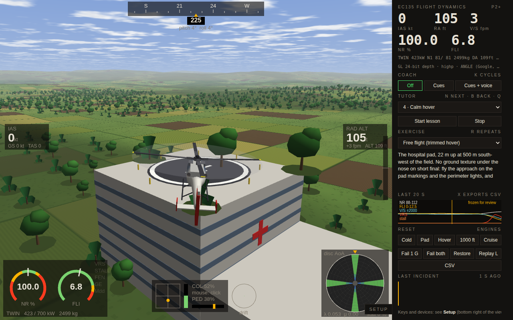
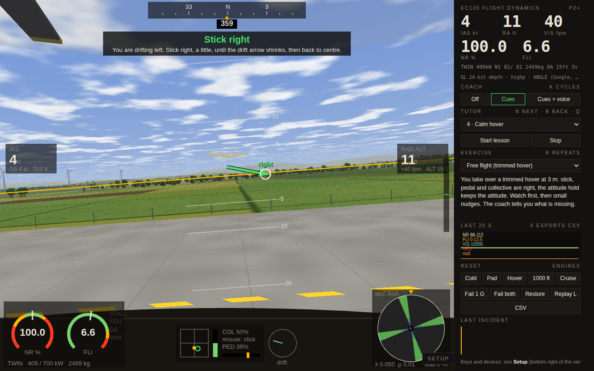
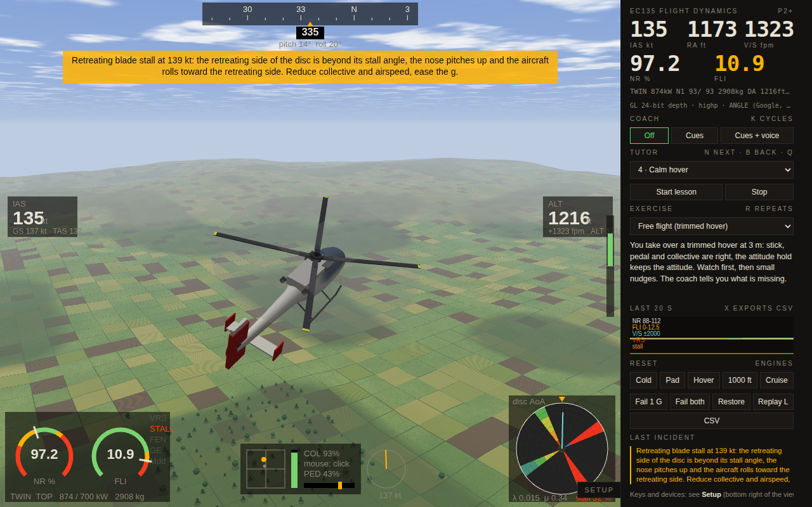

# EC135 Flight Dynamics

**Learn to hover and fly a helicopter, one step at a time, right in your browser.**



The hover is the first thing a helicopter pilot learns, and the hardest. Four controls act on each other, and the aircraft answers every input a little late: the stick tilts the rotor, the rotor tilts the fuselage, and only the speed that builds up moves you. If you watch your position, you react four seconds behind and start to oscillate.

EC135 Flight Dynamics teaches that chain one piece at a time. A tutor hands you the controls one by one, starting from a hover that stands still on its own. A coach in the left seat shows the correction you owe right now as an arrow on the screen. Underneath runs a real rotor model of the twin-engine EC135, measured against published data for the type.

It is a trainer, not a game, and not a certified flight training device.

**[▶ Fly it here](https://gitcrush.github.io/EC135-FlightDynamics/)**: desktop browser recommended, nothing to install. Click *Start the tutor – lesson 1*.

## Getting started

1. Open the [live page](https://gitcrush.github.io/EC135-FlightDynamics/) on a desktop browser.
2. Choose *Start the tutor – lesson 1*.
3. Click into the view: the mouse is captured as the cyclic stick (`Esc` releases it). `W`/`S` or the mouse wheel is the collective, `A`/`D` or the mouse buttons are the pedals.
4. If something feels hard, press `V`: the autopilot flies and you watch how small its inputs are. `V` again hands the aircraft back.

## What you get

- **13 lessons** from a hands-off hover to the raw stick: first the collective, then the pedals, then the stick in five stages. Each step names one thing to do and checks itself.
- **A coach** that flies a shadow autopilot alongside you and shows the input it would add now, as arrows on the stick, collective and pedals, with one sentence naming the cause and the remedy. Spoken cues are optional.
- **An autopilot demonstration** (`V`): watch how calm a good hover looks, then take over.
- **Instruments that show the limits**: rotor speed and power with their limits, a drift vector for the hover, and a map of the angle of attack over the whole rotor disc.
- **An incident detector** that names what went wrong (vortex ring, retreating blade stall, low rotor speed, Fenestron at its limit, dynamic rollover) together with the standard recovery.
- **A flight recorder**: the last 20 seconds as a strip chart that freezes after an incident and as a replay through the same instruments, a debrief card after every landing, and CSV export.
- **Exercises** beyond the tutor: cold start, autorotation, a hospital rooftop pad, a confined area, an engine failure in the hover and more. One or both engines, or the tail drive, can be failed at the press of a button.
- **Mouse, keyboard, gamepad or joystick**, with a setup panel that learns your controller from a single movement.

| The coach shows the correction you owe | Retreating blade stall near 140 kt: the detector names it, the rotor map shows where the disc stalls |
|---|---|
|  |  |

The simulator is the single file [`index.html`](index.html), served by GitHub Pages: no libraries, no assets, nothing loaded from anywhere else. You can open the [live page](https://gitcrush.github.io/EC135-FlightDynamics/) or download the file and open it locally.

---

## Under the hood

The rest of this page is for readers who want to know how it works. The aircraft is an EC135 P2+: 2.5 t, a bearingless four-blade rotor, a Fenestron tail and two turbines with FADEC.

**Tutor and coach.** The tutor hands over the stick in five stages: a calm hover hands-off, a tether that lets the aircraft tilt but not drift, one axis at a time, the stick as a velocity command with the help faded out, and finally the raw stick. Every airborne start begins in a hover trimmed to stand still hands-off, so you first learn what calm looks like. The coach (`K`) cycles through off, cues, and cues + voice. Cues are on by default; speech is opt-in, because browser voices vary a lot. Its sentence names rotor limits first.

**Exercises**: cold start, lift-off, pedal turns, quick stop, slope landing, a hospital rooftop pad, a confined area, autorotation, vortex ring recovery, an approach behind a phantom aircraft and an engine failure in the hover. Failures: one engine, both engines, and the tail drive (no anti-torque).

## Controls

| | Mouse (captured) | Keyboard | Gamepad |
|---|---|---|---|
| Cyclic (stick) | movement, starts at neutral | arrow keys | right stick |
| Collective | wheel | `W` / `S` | left stick vertical, triggers |
| Pedals | left / right button | `A` / `D` | left stick horizontal |
| Look around | hold middle button | hold `C` | |

`T` trim to the present attitude · `Shift` + arrows beep trim · `Y` back to the hover trim · `H` hover assist (stick = velocity) · `V` autopilot demonstration · `K` coach off / cues / voice · `L` replay · `X` CSV export · `E` engines start/stop · `G` engine failure · `R` repeat the reset · `1 2 3` cockpit, chase, tower view · `F` flight path marker · `P` pause · `N B Q` tutor next / back / quit · `?` key list.

A key is on or off, a hand is not, so each keyboard control has a pilot model: the collective is metered against the power and the rotor speed (and thrown down when the rotor droops or the engines quit), the pedal keys command a yaw rate with heading hold, and the arrow keys move the stick in two stages so that a tap stays fine. Real controls are analog; a gamepad or joystick is the bigger step. The setup has a **gamepad panel** that shows every axis and button live, learns each function from a single movement, and stores the mapping in the browser.

### Training aids

On by default, each can be switched off in the setup: **SAS** (rate damping with the trim fed forward), **attitude command** (a centred stick holds the trim attitude; fine around the centre, 28° pitch and 40° bank at the stops), **heading hold** (rate command and heading hold in the hover, turn coordination with a roll-axis heading hold above 45 kt) and **hover assist** (the stick commands a ground velocity). Two couplings a pilot's hands and feet take out are mixed in with the aids on: pedal with collective, and in the hover the roll attitude with collective.

## What you see

Three views (`1` `2` `3`): cockpit, chase and tower.

**Cockpit view**: heading tape, airspeed and radar altitude, a horizon and pitch ladder drawn with the scene's own projection, the flight path marker. Bottom left the rotor speed (NR) and the first limit indicator (FLI: 10 = maximum continuous, 11 = take-off power) with lamps for vortex ring, stall, Fenestron limit, ground effect and drag divergence. Bottom centre the stick, collective and pedal positions, the skid loads on the ground and the drift vector. Bottom right the rotor-state map.

**Side panel**: the large numbers, the coach and tutor controls, the exercise brief, a 20-second strip chart of NR, FLI, vertical speed, vortex ring and stall, resets and engine failures, the last incident. After every landing a debrief card shows the touchdown rate, the power and rotor-speed band and the incidents.

The scene is drawn with WebGL and no libraries: an airfield with runway, taxiway, apron and pad markings, fields with crop rows and hedgerows, about 6,700 trees, a village, a lake, wind turbines that turn with the wind, a power line, a control tower, a hospital with a rooftop pad and a ridge on the horizon, under a cloud layer that drifts with the wind.

## Physics model

The model is a textbook rotorcraft model rather than a game-tuned flight model. It runs at 360 Hz (55 steps per rotor revolution) with a semi-implicit Euler integrator, and every mechanism is written down in the code with what it models and why.

**Main rotor** — blade-element model, time-marching per blade: four blades, eight elements each, every blade a rigid beam on an offset flap hinge. The flap equation comes from the Euler equation of the blade with the hub rotating at body rates, so rotor damping, the control phase, flapback with speed, the cross-coupling off nominal rotor speed and the hub moment that makes a hingeless rotor crisp all fall out of the same loop. Section aerodynamics with Mach-dependent stall and drag divergence, tip loss, linear twist and flap/pitch coupling.

**Inflow** — Pitt-Peters dynamic inflow: a uniform state with apparent mass, the Glauert skew gradient and moment-driven gradient states. The vortex-ring region uses Leishman's empirical curve with seeded unsteadiness, and in the developed ring collective added beyond the entry value goes into recirculation instead of thrust (power settling); ground effect after Cheeseman and Bennett.

**Fenestron** — ducted-fan momentum theory: the fan carries about half the static thrust and the shroud the rest, the shroud's share fades with in-plane flow and does not work for reverse thrust; three blade elements with stall; the main-rotor wake at the tail. It takes its power from the main rotor, so at the power limit a pedal turn in the rotor's direction droops the rotor; in a fast left yaw the fan's own inflow can stall it, the unanticipated-yaw trap. A tail drive failure leaves the fin and the collective.

**Engines and rotor speed** — two turbines as power lags with acceleration limits, a FADEC governor with load feed-forward, engine and gearbox ratings (maximum continuous, take-off, OEI 30 s), a freewheel that lets the rotor autorotate, a start sequence with a run-up torque schedule, shutdown, fuel burn. Every engine rating lapses with the air (k = 0.789 · δ · θ^-1.55, fitted to the published hover ceilings): at sea level the gearbox limits, higher or hotter the turbines do, and the FLI shows whichever is closer.

**Airframe and ground** — fuselage drag by axis with the side area spread along cabin and tail boom (a spinning aircraft drags its boom sideways, which is the main yaw damping), destabilising fuselage moments, rotor download, a stabiliser with the rotor-wake hump through transition, a cambered fin that unloads the Fenestron in cruise and keeps resisting beyond its stall. Four skid contact points and a tail bumper with anisotropic friction, so dynamic rollover, blade strike and tail strike are consequences, not scripts.

**Environment** — ISA with a temperature offset, wind with a boundary layer, Dryden-like turbulence and gusts; terrain from a deterministic noise that the renderer and the physics share, so a skid over a roof edge falls off it.

**Control laws** — the aids above are written to be bumpless: every change of law (lift-off, switching an aid, the autopilot handing back, the tutor handing over an axis) starts from the stick the previous one left. The trim is measured for the current mass, CG and wind at every reset. Light on the skids, the attitude command finds the hover attitude while the aircraft still pivots on its right skid, so it comes free without a sideways step.

Details, tables and the reasoning are in [`docs/TECHNICAL.md`](docs/TECHNICAL.md).

## Measured behaviour

From the test suites, 2500 kg, ISA, calm:

| Quantity | Model | Reference / expectation |
|---|---|---|
| Hover out of ground effect, 1000 ft | 426 kW, FLI 6.9, blade pitch 9.2°, right pedal 40 % | ~55–65 % torque at this weight |
| Hover attitude | 3.5° nose up, 4.1° right skid low | right skid low for a clockwise rotor |
| Power in ground effect (skids at 0.3 m) | −11 % | Cheeseman–Bennett, 10–18 % |
| Level flight power: 60 / 100 / 120 / 135 kt | 256 / 348 / 469 / 597 kW | bucket at 55–70 kt, maximum continuous ~640 kW |
| Climb at Vy, take-off power | 2200 fpm | ~2000 fpm at this weight (estimate) |
| Autorotation, 65 kt | 2070 fpm, NR 100 % | 1700–2200 fpm |
| Vne 155 kt in a shallow descent | 10 % forward stick left, advancing tip Mach 0.82 | control margin at Vne |
| Retreating blade stall, 140 kt and 1.8 g | nose up 18°, roll to the right | roll to the retreating side |
| Low g (0.16 g) | full roll control | hingeless rotor, no mast bumping |
| Hover ceiling out of ground effect, 2835 kg | holds at ~2685 m ISA, sinks above ~1750 m ISA+20 | 2685 m ISA, 1785 m ISA+20 (EC135 P2 data) |
| Vortex ring, developed (2500 kg) | collective only: 266 m lost, sink grows to 4000 fpm; classical 46 m; Vuichard 40 m | collective alone deepens it; Vuichard least height |
| Tail drive failure | hover: 175 °/s left after 2 s; 100 kt: fin holds at 7° sideslip; yaw lost below ~47 kt | run-on landing with speed |
| Engine failure in the hover, pedals still | nose yaws right at ~100 °/s | torque reaction gone |
| One engine inoperative in the hover | held, NR minimum 98 % | Category A performance class |
| Autorotation flared at 120 ft | touchdown 280 fpm, NR peak 109 % | below the hard-landing limit |
| Cold start to 100 % NR / rotor stop | 53 s / 73 s | about a minute each |
| Pedal turn at the power limit | right (rotor direction) droops NR; left is mild | turns in the rotor direction cost power |

## Sources and calibration

Rotor, controls, stabiliser and Fenestron data come from Kampa, Enenkl, Polz, Roth (Eurocopter Deutschland), *Aeromechanic Aspects in the Design of the EC135*, 23rd European Rotorcraft Forum, Dresden 1997 (ERF archive): rotor moment capacity of about 2000 Nm per degree of flapping, 10° twist, 7.5° flap/pitch coupling, cyclic ranges and stick travel, pitch and roll bandwidth, stabiliser and fin geometry, Fenestron geometry. The hover ceilings (EC135 P2 at 2835 kg: 2685 m ISA, 1785 m ISA+20, out of ground effect) come from a public type datasheet and calibrate the turbine lapse. The vortex-ring recovery advice follows Airbus Helicopters Safety Information Notice 3463-S-00 (classical technique first; Vuichard, for a clockwise rotor left cyclic with right pedal, where there is no room ahead). The model form follows Seher-Weiß, *ACT/FHS System Identification Including Rotor and Engine Dynamics*, Journal of the American Helicopter Society 64, 2019 (DLR). Still estimates: the inertias, the fuselage drag areas, the split of the longitudinal cyclic range, the P2+ gearbox limits, the Fenestron duct factor and its blade stall angle (16°, set so that the fan keeps a yaw-control margin at the hover ceiling), and the strength of the power-settling term. The calibration table is in [`docs/TECHNICAL.md`](docs/TECHNICAL.md).

## Known limitations

- The aircraft data is partly estimated (see above); handling qualities are plausible against the published bandwidths, not certified against flight-test data. The Dutch roll comes out stiff (period about 1 s against the 2–4 s typical of light helicopters); that needs data.
- No flight model of the airframe's structural modes, no blade lag, no rotor icing, no weather beyond wind and turbulence.
- One aircraft, one area of about 3 × 3 km. No night lighting, no shadows from trees and buildings; the power line is visual only.
- The keyboard is a compromise: every key goes through a pilot model. A gamepad or joystick is recommended.
- Speech for the coach is off by default; it uses the browser's built-in voices, whose quality varies.
- In an embedded frame some browsers block the Gamepad API; the gamepad panel says so. Download the file and open it locally.

---

## Test harness

The physics and the browser code run headless in Node against DOM stubs; the browser build and the tests run byte-identical code. Every suite exits non-zero on failure and runs in CI on every push.

```
npm test                 # physics reference + tutor + handling
npm run scenarios        # scenario analysis, groups A to E
node test/controls.js    # open-loop control response audit
```

| Suite | What it checks |
|---|---|
| `test/consistency.js` | 70+ physics reference checks: hover trim, free response, governor, ground effect, power curve, climb, autorotation, vortex ring, control response, OEI, crosswind, MTOW cruise, cold start, ground handling and dynamic rollover, determinism, invariants |
| `test/tutor.js` | every one of the 48 tutor steps is passable by an ideal student, on the complete real code |
| `test/handling.js` | the human control path: keys, mouse and gamepad through the input models and control laws; jumps, swing-back, overshoot, asymmetry, wind-up, hand-overs, gamepad mapping and dead zone, blocked Gamepad API |
| `test/scenarios.js A\|B\|C\|D\|E` | signs and magnitudes in normal and limit manoeuvres: A yaw and pedals; B cyclic, blade stall, low g, Vne, quick stop, autorotation landings; C the aids in those manoeuvres; D main and tail rotor at the power limit, tail drive failure, weathercock, loss of yaw authority; E hover and cruise modes, transverse flow, vortex-ring recoveries |
| `test/browser.py` | headless Chromium smoke test (Playwright) |
| `test/uishot.py` | renders the screenshots in this README |

See [`test/README.md`](test/README.md).

## Building from source

The page is assembled from modules:

```
src/00_util.js … 70_pilot.js     physics, autopilot, trim and control laws (loaded by the tests)
src/80_input.js … 97_sound.js    input, rendering, HUD, coach, tutor, replay, UI, sound
html/template.html               layout and CSS
build.py                         concatenates src/*.js into the template → index.html
```

```
python3 build.py         # writes index.html
```

Edit `src/`, run `python3 build.py`, commit both. CI checks that `index.html` matches the sources.

## Deploying

GitHub Pages serves `index.html` from the repository root: *Settings → Pages → Build and deployment → Deploy from a branch → `main` / `(root)`*. The empty `.nojekyll` file keeps Pages from processing the repository. Any static host works the same way; the file has no external dependencies at all.

## Relation to Grenzbereich

This project transfers the approach of [Grenzbereich](https://github.com/GitCrush/grenzbereich), a rally vehicle-dynamics trainer, to a helicopter: textbook physics with every mechanism justified in the code, driver (here pilot) models for each input device, instruments that make the limit legible, an incident detector that names causes, and a headless harness that keeps the physics honest.

## Contributing

Physics changes are welcome when they come with a check in the harness and a rationale in the code. The comment style is deliberate: every mechanism states what it models, why it is there and what breaks without it. Handling changes need to keep `test/handling.js` and `test/scenarios.js` clean. Open work is listed in [TODO.md](TODO.md); good first topics are blade lag, tree and building shadows, wires as an obstacle, and touch controls.

## Licence and disclaimer

Apache License 2.0 — see [LICENSE](LICENSE) and [NOTICE](NOTICE).

This is an independent training and educational project. It is not affiliated with, endorsed by or derived from data of Airbus Helicopters; "EC135" refers to the helicopter type it models. It is not a certified flight training device and not a substitute for instruction or for the aircraft's flight manual.
